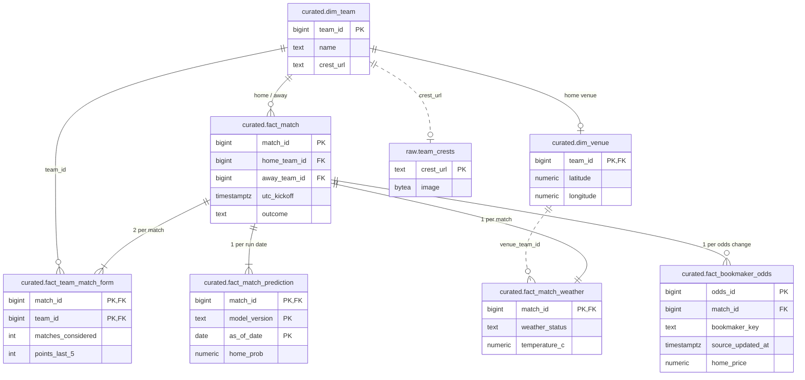
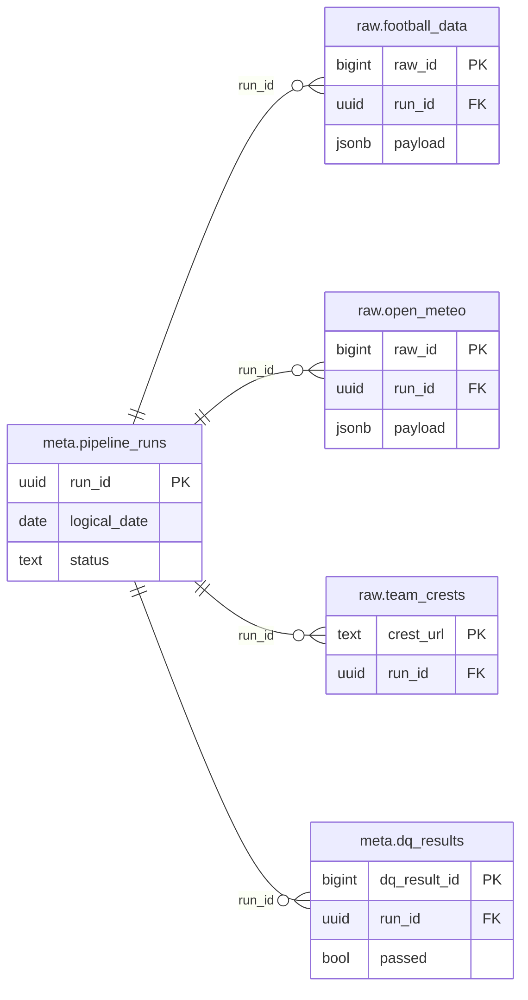

# Champions League Match Intelligence Data Platform

HSLU · DENG – Data Engineering · HS26 · End-to-End Batch Data Pipeline

[](https://github.com/Elias-Martinelli/deng/actions/workflows/ci.yml)

A reproducible daily batch pipeline that collects UEFA Champions League
fixtures, results, standings, weather and bookmaker odds and assembles them
into a curated, point-in-time-correct dataset — the foundation on which a
model can later predict who wins a match. **The pipeline is the product**; the
Streamlit viewer is a preview of its data, including a baseline forecast next
to the odds of real bookmakers.


How the pieces fit: [Architecture](#architecture) · what is done and what is
not: [Project Status](#project-status).

**Quick start** (no API key needed):

```bash
./setup.sh && make up && make init && make run-samples && make app
```

---

## Table of contents

[Overview](#project-overview) · [Problem](#problem-statement) · [End user](#end-user) ·
[Data product](#data-product) · [Use case](#use-case) · [Data sources](#data-sources) ·
[Data characteristics](#data-characteristics) · [Quality risks](#data-quality-risks) ·
[Architecture](#architecture) · [Ingestion](#batch-ingestion-strategy) ·
[Local development](#local-development) · [PostgreSQL](#postgresql) · [Docker](#docker) ·
[Orchestration](#workflow-orchestration) · [Transformation](#transformation) ·
[Data model](#data-model) · [Data quality](#data-quality) ·
[Reproducibility](#reproducibility) · [Verification](#verification) ·
[Notebook](#analytics--notebook) · [Streamlit](#streamlit-application) ·
[Cloud](#google-cloud-architecture) · [Limitations](#known-limitations) ·
[Status](#project-status) · [Contributing](#contributing-and-branch-strategy) ·
[Authors](#authors)

---

## Project Overview

Information about an upcoming Champions League match is scattered across
sources that update at different speeds: the fixture list is published months
ahead, standings change after every matchday, weather forecasts only become
meaningful two weeks out, and line-ups appear an hour before kick-off.

This platform ingests those sources on a schedule, keeps every raw payload,
and derives curated tables that answer **what was known about a match at a
given point in time**. That property is what a match-outcome model needs: it
may only learn from information that existed before kick-off. Building that
model is the downstream use of the data, not part of this project.

## Problem Statement

The source APIs only ever answer with today's state; what was known last week
is gone unless someone stored it. Training a model on match data therefore
means integrating several APIs every day, reconciling their keys, and recording
*when* each piece of information became available. A model trained on form or
weather that already contains the match it predicts looks excellent in testing
and fails in reality (data leakage).
Details: [`docs/use-case.md`](docs/use-case.md).

## End User

* **Primary: a data scientist or analyst** who wants to build and evaluate a
  match-outcome model (HOME_WIN / DRAW / AWAY_WIN) and needs a clean,
  documented, leakage-free table to train it on.
* **Secondary: football-interested users** who look at an upcoming fixture in
  the Streamlit viewer - a preview of what the pipeline holds.

## Data Product

| Table | One row represents | Role for a model | Status |
|---|---|---|---|
| `curated.fact_match` | one Champions League match | label: `outcome`, derived from the goals | **implemented** |
| `curated.fact_team_match_form` | one team's participation in one match, with its form going in | features known before kick-off | **implemented** |
| `curated.fact_match_weather` | one match | forecast for the kick-off hour, fetched before kick-off, or why it is missing | **implemented** |
| `curated.fact_match_prediction` | one match, one model version, one run date | the baseline model's HOME/DRAW/AWAY probabilities as of that run | **implemented** (baseline) |
| `curated.fact_bookmaker_odds` | one odds change of one bookmaker for one match | the market's view, with the bookmaker's timestamp and ours | **implemented** |
| `curated.dim_team`, `curated.dim_venue` | one team / one home venue | descriptive attributes, coordinates | **implemented** |
| `curated.fact_match_snapshot` | one upcoming match on one pipeline run date | **the training table**: everything known on that day | planned (final) |
| `curated.dim_date` | one calendar day | partition pruning in BigQuery | planned (final) |

Full definitions, keys and reasoning: [`docs/data-model.md`](docs/data-model.md).

## Use Case

1. **Model development** - train a baseline HOME/DRAW/AWAY classifier on
   features taken *N days before kick-off* and test it on later matchdays. The
   pipeline guarantees that every feature row only contains what was known at
   that point.
2. **Availability analysis** - how many days before kick-off does a usable
   forecast exist, how often do kick-off times move?
3. **Data preview** - pick a fixture in the Streamlit viewer, e.g. *RC Lens vs
   Sporting CP, 13 Oct 2026*, and see the features a model would get, their
   window sizes and states, data freshness and quality results. Everything is
   served from our own tables; the app makes no API calls.
4. **Model versus market** - for the same fixture, the baseline model's
   probabilities next to the 1X2 odds of named bookmakers, with both
   timestamps, the margin-free market probability, the deviation in
   percentage points and how both moved towards kick-off. The odds are fetched
   by the pipeline under a credit budget, never by the app.

A single league phase has 144 matches - too few to train on. Past seasons are
served by the API, so loading several of them is the planned lever (backlog 1.9).

## Data Sources

| Source | Content | Access | Limits (free tier) |
|---|---|---|---|
| [football-data.org v4](https://www.football-data.org) | CL fixtures, results, standings, teams, referees, head-to-head | REST/JSON, `X-Auth-Token`, free registration | 10 requests/min; no line-ups, injuries or match statistics; 11 of 36 clubs without domestic-league data |
| [Open-Meteo](https://open-meteo.com) | 16-day hourly forecast for the kick-off hour | REST/JSON, no key | 10 000 calls/day, CC BY 4.0 |
| [OpenStreetMap](https://www.openstreetmap.org) via `make venues` | stadium coordinates, once per season → `data/reference/venues.csv` | Nominatim, 1 req/s | ODbL |
| [The Odds API](https://the-odds-api.com) v4 | 1X2 odds (h2h, regular time) of ~25 European bookmakers per upcoming match, with each bookmaker's timestamp | REST/JSON, `apiKey`, free registration; optional | 500 credits/month, one per fetch; polled only in a window before watched matches ([ADR-005](docs/adr/ADR-005-bookmaker-odds-source.md)) |
| `data/reference/venues.csv` *(planned)* | stadium coordinates and time zones | versioned in this repo | maintained by hand |

Evaluation including rejected alternatives: [`docs/data-sources.md`](docs/data-sources.md).
Decisions: [ADR-001](docs/adr/ADR-001-football-data-source.md) (football, weather),
[ADR-005](docs/adr/ADR-005-bookmaker-odds-source.md) (odds), both ACCEPTED.
Measured behaviour of the live API: [`docs/evidence/api-exploration.md`](docs/evidence/api-exploration.md).

## Data Characteristics

* **Volume** (measured 20 Sep 2026): 144 league-phase matches, 36 teams, one
  standings table. ≈ 60 API calls and < 2 MB raw per daily run; < 1 GB per
  season. All 47 listed seasons together are roughly 5 000–6 500 matches.
* **Format:** nested JSON. Business keys are stable integers (`match.id`,
  `team.id`, `season.id`).
* **Change behaviour:** kick-off times and statuses change in place, scores are
  appended once, and **new fixtures appear mid-season** — the knockout rounds
  are drawn in December. This is the main argument for a scheduled daily batch
  rather than a one-off load.

## Data Quality Risks

Identified by measurement, not assumption ([evidence](docs/evidence/api-exploration.md)):

| Risk | Handling |
|---|---|
| `?status=SCHEDULED` returns rows stored as `TIMED` | upcoming matches are selected by `utc_kickoff`, never by the status string |
| The API's own aggregates do not add up (`wins+draws+losses ≠ count`) | all form figures computed from individual match rows; a constraint and a check enforce that ours add up |
| `standings.form` is always null | not used |
| `odds` is a stub object with a marketing message | not parsed; odds come from The Odds API instead |
| Bookmakers spell club names their own way ("Bayern Munich", "Inter Milan") | events are resolved by kick-off time plus name similarity and an alias file; an unresolved event stays `UNMATCHED` and a WARNING check names it - never guessed |
| A bookmaker suspends or withdraws a market before kick-off | a quote with fewer than three prices is stored as `is_complete = false`; one the latest fetch no longer carries is shown as withdrawn - both flagged in the app, not dropped |
| 11 of 36 clubs have no domestic-league data in the free tier | scope is Champions League only for every club ([ADR-004](docs/adr/ADR-004-champions-league-scope.md)), so form is comparable across all 36 |
| `group` null since the 2024/25 format change | no group dimension modelled |
| Matches rescheduled or postponed | full reload per day; the raw zone keeps each day's version |

## Architecture

The diagram at the top shows the local stack. One daily run, orchestrated by
Dagster, in three steps:

| Step | Trigger | What it does |
| --- | --- | --- |
| **1. Ingest** | daily 06:00 Europe/Zurich, plus backfill on demand | Fetches fixtures, results, teams and standings; forecasts for matches ≤ 16 days ahead; missing club crests. Stores every answer unchanged in `raw` with an idempotent upsert per day |
| **2. Transform** | after a successful ingest | SQL in one transaction: `raw` → typed `staging` → `curated` facts and dimensions, incl. point-in-time form and the weather status per match |
| **3. Quality checks** | after the transformation | 24 checks stored in `meta.dq_results`; a CRITICAL failure fails the run, a WARNING stays visible |
| **Odds refresh** (own job) | every 15 min, configurable | Decides whether to spend a credit - once a day always, at the interval only while a watched match is within 48 h of kick-off, never below the quota reserve - then stores the fetch and rebuilds the odds change history |

Colours in the diagram: grey = outside world (sources, consumers), blue =
processing step, purple = storage and orchestration; dashed = control, not
data. The source of the picture is [`docs/architecture.svg`](docs/architecture.svg)
(plain SVG, readable in light and dark mode).

* [Architecture v0.1](docs/architecture/architecture-v0.1.md) — the initial
  design with Mermaid diagrams for the conceptual, local and cloud views.
* [Architecture Decision Records](docs/adr/README.md) — data sources,
  orchestrator, raw storage, Champions League scope.
* Architecture v0.2 (midterm) will record what implementation changed.

## Batch Ingestion Strategy

One scheduled run per day. Each run: **extract → store raw → transform →
data-quality checks**.

Load strategy per endpoint — all **FULL** at this stage, with the reasoning
kept next to the code in [`src/deng/ingestion/extract.py`](src/deng/ingestion/extract.py):

| Endpoint | Rows | Strategy | Why |
|---|---|---|---|
| `competitions/CL` | 47 seasons | FULL | 9 KB, changes rarely |
| `competitions/CL/teams` | 36 | FULL | feeds `dim_team`, stable within a season |
| `competitions/CL/standings` | 36 | FULL | changes every matchday, one request |
| `competitions/CL/matches` | 144 | FULL | 212 KB in one request |
| Open-Meteo `v1/forecast` | 1 per venue with a match ≤ 16 days ahead | FULL per venue and day, **today only** | the forecast changes daily and every day's version is kept; a past date would return analysis data, not a forecast |
| club crests | 36 images | **INCREMENTAL** by URL | a changed crest gets a new URL, so a stored one is never fetched again |
| The Odds API `sports/{sport}/odds` | every upcoming event × every bookmaker | **FULL per fetch, append-only** | one credit answers the whole competition; every fetch is a new row because the intraday history *is* the data. Budget rules in [`src/deng/ingestion/odds.py`](src/deng/ingestion/odds.py) |

Incremental loading via `lastUpdated` would cost an extra request to discover
what changed and would still miss matches the API *adds* mid-season. A full
reload of a small bounded payload is simpler, self-heals after a missed day and
costs one request. That stops being true once we ingest many seasons at once —
then incremental *by season* is the plan (backlog 1.9).

**Failure behaviour:** transient errors (429, 5xx, network) retry with
exponential back-off; 400/403/404 fail immediately because repeating them
cannot help and would spend the request budget. Requests are paced against the
`X-Requests-Available-Minute` header. Every run is recorded in
`meta.pipeline_runs`, failures included, with their error message.

## Local Development

Requirements: **Python ≥ 3.10** (the version Ubuntu 22.04 LTS ships, so no
upgrade is needed), `make`, and on Debian/Ubuntu/WSL the `python3-venv` package
(`sudo apt install python3-venv`). Docker is needed for the containerised path.

```bash
git clone https://github.com/Elias-Martinelli/deng.git
cd deng

./setup.sh                 # venv + install + .env + self-check   (or: make setup)
make doctor                # interpreter, dependencies, .env, API key
make test                  # 135 tests; the database ones skip without PostgreSQL
make up                    # PostgreSQL in Docker, waits until healthy
make init                  # create schemas and tables (idempotent)
make run-samples           # ingest + transform + data quality, no API key needed
make verify                # verification queries
```

`setup.sh` picks the newest interpreter ≥ 3.10 that can actually build a
virtualenv and tells you which one it used; override with
`make setup PYTHON=python3.12`. Activating the venv is optional — every `make`
target uses `.venv` directly.

With an API key (free registration at
<https://www.football-data.org/client/register>), put it in `.env` and use the
live path:

```bash
make explore               # fetch fresh sample payloads and profile the schema
make run                   # ingest from the API + transform + data quality
```

Bookmaker odds are optional. With a free key from <https://the-odds-api.com>
in `.env` as `ODDS_API_KEY`:

```bash
make odds                  # fetch if the budget rules allow, then rebuild the odds tables
make odds ODDS_FORCE=1     # fetch now, regardless of window and interval
```

Without a key the step skips itself and says so; `make run-samples` replays
two committed sample fetches (fictional prices,
[`data/sample/the-odds-api/`](data/sample/the-odds-api/README.md)) so the
whole path works offline.

`make help` lists every target.

## PostgreSQL

Four schemas, separated by how far the data has been processed:

| Schema | Content |
|---|---|
| `raw` | API payloads exactly as received (JSONB) plus ingestion metadata - one table per source, the odds one append-only per fetch |
| `staging` | typed, flattened tables — rebuildable from raw at any time |
| `curated` | facts and dimensions: the data product |
| `meta` | `pipeline_runs`, `dq_results` |

`raw.football_data` holds **one row per (source, endpoint, request parameters,
ingestion date)**. A `UNIQUE` constraint on exactly that key plus
`INSERT … ON CONFLICT DO UPDATE` is what makes reruns safe; a `payload_hash`
over the canonical JSON shows whether the source actually changed that day.

### Entity-relationship diagram (simplified)

Keys and a few defining columns only; every column, grain and constraint is in
[`docs/data-model.md`](docs/data-model.md). `staging` is left out: it is the
typed copy of `raw`, connected by the transformations, not by foreign keys.

**The data product** — `dim_team` in the middle, one fact table per question:



**Run log and raw zone** — every raw row and every check result points to the
run that wrote it:



How to read it: `||` exactly one, `o|` zero or one, `|{` one or many,
`o{` zero or many. **Solid lines are foreign keys** enforced by PostgreSQL;
**dashed lines are join keys without a constraint**, on purpose:
`venue_team_id` - a club missing from `venues.csv` (e.g. new after the
knockout draw) must not abort the weather run; its matches get `VENUE_UNKNOWN`
and a WARNING check reports it. `crest_url` - a crest is optional and fetched
after the team exists.

DDL: [`sql/schema/`](sql/schema/) · transformations: [`sql/transform/`](sql/transform/) ·
verification: [`sql/verify/`](sql/verify/).

## Docker

```bash
make up            # PostgreSQL with a health check and a named volume
make docker-ingest # run the pipeline inside its own image
make docker-app    # Streamlit viewer in a container → http://localhost:8501
make down          # stop (keeps data);  make reset  also deletes the volume
```

Services on one network: `postgres`, `dagster-webserver` and `dagster-daemon`
(started by `docker compose up -d`), the `pipeline` image for manual runs and
the `app` image (profile `app`). The pipeline is a batch job, not a daemon: the
orchestrator runs it on schedule, and `docker compose run` runs it by hand. Dependent services wait for
the database's *health check*, not merely for the container to exist, so a cold
start cannot fail with "connection refused". The app is a second build stage,
which keeps the pipeline image free of a web framework.

> **Docker not running?** Every Docker target first runs
> `scripts/ensure_docker.sh`: on Windows/WSL and macOS it starts Docker Desktop
> itself and waits until the engine answers (up to 3 minutes). On Linux it
> prints the command to start the daemon. If Docker Desktop starts but WSL
> still cannot see it, enable *Settings → Resources → WSL integration* for your
> distro once.

> **Port 5432 already taken?** If PostgreSQL is also installed natively, it
> keeps `localhost:5432` and host-side commands (`make init`, `make test`)
> silently talk to *that* database instead of the container. Set
> `POSTGRES_PORT=5433` in `.env` before `make up`. `ss -ltn | grep 5432` shows
> whether something is listening.

Executed end to end on an empty volume, including the three defects that the
first real run exposed: [evidence §11](docs/evidence/local-pipeline-run.md#11-docker-compose-executed-21-september-2026).

## Workflow Orchestration

**Dagster**, decided after a spike ([ADR-002](docs/adr/ADR-002-workflow-orchestrator.md)).
One asset per table, one daily partition per logical date:

```text
raw/football_data ──► staging/{matches,teams,standings} ──► curated/{dim_team,fact_match,fact_team_match_form} ─┐
curated/dim_team  ──► raw/team_crests ─────────────────────────────────────────────────────────────────────────────┼─► meta/dq_results
curated/fact_match ─► raw/open_meteo ──► staging/weather_forecast ──► curated/{dim_venue,fact_match_weather} ──────┘
      ingest                         transform (one transaction)                                         data quality
```

```bash
make orchestrator          # PostgreSQL + Dagster webserver + daemon → http://localhost:3000
make dagster-backfill FROM=2026-09-15 TO=2026-09-17   # one run per day, one at a time
```

* **Schedule:** `daily_pipeline_schedule`, 06:00 Europe/Zurich, active as soon
  as the daemon runs. The 06:00 run ingests under *today's* date.
* **Second job:** `odds_refresh`, unpartitioned, every `ODDS_REFRESH_MINUTES`
  (default 15). Most ticks decide *not* to fetch: the asset applies the budget
  rules (daily baseline, watch window before kick-off, quota reserve) and
  records the reason in its metadata. Odds are not daily data, so they cannot
  share the daily partitions - hence the separate job.
* **Dependencies:** a failed ingest does not start the transform; a CRITICAL
  data-quality failure fails the run, a WARNING shows up in the asset metadata.
* **Retries:** only for transient errors (HTTP 429/5xx, network, database not
  reachable): 3 attempts, 1 → 2 → 4 minutes. A 403, a missing API key or a
  failed check fails at once - repeating it cannot change the answer.
* **Reruns and backfills:** re-materialise any partition in the UI or with
  `make dagster-backfill`. Safe because the raw load is an upsert and staging
  never overwrites newer data with older.
* **No API key?** Set `INGEST_SOURCE=samples` in `.env`; schedule and backfills
  then replay the committed payloads.
* **Without Docker:** `make setup-orchestrator && make dagster-dev`.

The assets call the same functions as the CLI, so the manual path still works
and is what the orchestrator runs:

```bash
python -m deng.pipeline run --date 2026-09-18
python -m deng.pipeline backfill --from 2026-09-01 --to 2026-09-10
```

## Transformation

SQL files executed in order inside **one transaction**: either every curated
table is consistent with the same staging state, or nothing changed and the
previous data product is still there.

| Step | File | Produces |
|---|---|---|
| 1 | `110_staging_matches.sql` | `staging.matches` from raw JSONB |
| 2 | `111_staging_teams.sql` | `staging.teams` |
| 3 | `112_staging_standings.sql` | `staging.standings` (one snapshot per day) |
| 4 | `210_dim_team.sql` | `curated.dim_team` |
| 5 | `220_fact_match.sql` | `curated.fact_match` incl. derived outcome |
| 6 | `230_fact_team_match_form.sql` | `curated.fact_team_match_form` |
| 7 | `310_staging_weather_forecast.sql` | `staging.weather_forecast` (hourly, one version per day) |
| 8 | `320_dim_venue.sql` | `curated.dim_venue` from `venues.csv` |
| 9 | `330_fact_match_weather.sql` | `curated.fact_match_weather`: forecast or reason, per match |
| 6b | `240_fact_match_prediction.sql` | `curated.fact_match_prediction`: the baseline model, one forecast per match and run date (part of the first transaction) |
| 10 | `410_staging_bookmaker_odds.sql` | `staging.bookmaker_odds`: one row per quoted outcome of every fetch not staged yet |
| — | `deng.ingestion.odds.match_events` | `staging.odds_event_match`: bookmaker event → fixture, by kick-off time, name similarity and aliases (Python) |
| 11 | `420_fact_bookmaker_odds.sql` | `curated.fact_bookmaker_odds`: one row per odds change with fair probabilities |

Steps 7–9 are a **second transaction**: which forecasts to fetch is read from
`fact_match`, so the weather can only be fetched after steps 1–6 committed.
Steps 10–11 run on every odds fetch, with the event matcher between them.

Justification for the two non-trivial ones:

* **`fact_match`** derives `outcome` from the goals instead of copying the
  API's `score.winner`, so the ML label can never contradict the numbers in its
  own row, and derives `is_upcoming` from the kick-off time instead of the
  status string, which the source uses inconsistently.
* **`fact_team_match_form`** computes each team's last-5 form from matches
  finished *strictly before* that match's kick-off. This directly serves the
  use case (the app shows it, a model would train on it) and is the mechanism
  that prevents data leakage.
* **`fact_match_weather`** takes the newest forecast *fetched before kick-off*
  for the kick-off hour - the same leakage rule - and gives every match a
  `weather_status` (`AVAILABLE`, `NOT_YET_AVAILABLE`, `VENUE_UNKNOWN`,
  `NOT_CAPTURED`, `MISSING`) instead of a silent null.
* **`fact_match_prediction`** is the baseline model `form-poisson-v1`, in SQL:
  Poisson goal rates from the league's home/away averages and each team's
  last-5 attack and defence, every input restricted to matches finished
  before the predicted match's kick-off. One row per match and run date,
  so the forecast is versioned and a comparison can use the forecast that
  existed when the odds were read. It is the thing the odds are compared
  with, not a claim to beat the market.
* **`fact_bookmaker_odds`** keeps one row per *odds change* per bookmaker
  and market - the bookmaker's own timestamp, the prices, and the fetch
  interval in which we saw them - and removes the margin using the three
  prices of the same bookmaker at the same moment, never mixing bookmakers
  or moments.

The logic lives in `.sql` files rather than Python strings so it can be read,
reviewed and run by hand in `psql` — and so the BigQuery versions are the same
statements in a different dialect rather than a rewrite.

## Data Model

Grains, keys, facts and dimensions: [`docs/data-model.md`](docs/data-model.md).
Every grain is also a `COMMENT ON TABLE` in the database, so the documentation
cannot drift away from the schema.

## Data Quality

Twenty-four checks run after every transformation
([`src/deng/quality/checks.py`](src/deng/quality/checks.py)) and are persisted
to `meta.dq_results`, so "was the data good on 18 September?" is a query rather
than an archaeology exercise in old logs.

* **CRITICAL** failures fail the run: empty fact table, duplicate business
  keys, matches lost between staging and curated, a team playing itself, a
  finished match without an outcome, an outcome that disagrees with the goals,
  a match without exactly two form rows, form counts that do not add up, form
  built on matches that were not yet played, a team missing from `dim_team`.
* **WARNING** failures are recorded and visible but do not stop the pipeline:
  implausible scores, and how well populated the form window currently is
  (early in a season most teams have fewer than three completed matches — real
  and worth knowing, not a reason to discard the run).
* **Forecast and odds:** every match has a forecast and its probabilities sum
  to 1 (CRITICAL); a bookmaker's fair probabilities sum to 1 and an incomplete
  quote has none (CRITICAL); prices and margins plausible, every bookmaker
  event resolved to a fixture, and a fresh fetch when a match is within 24 h
  (WARNING). The odds checks pass on an empty odds zone, so a reviewer without
  a key never sees a failure from them.

```bash
make dq        # run the checks; non-zero exit on a CRITICAL failure
```

## Reproducibility

Treated as a feature in its own right:

* `setup.sh` / `make setup` need no pyenv, direnv or conda — only the standard
  library's `venv`.
* `--from-samples` runs the entire pipeline against committed payloads, so a
  reviewer can reproduce every result **before registering an API key**.
* CI runs lint, 135 tests and a two-run idempotency smoke test against a real
  PostgreSQL, on Python 3.10 and 3.12.
* Every number in [`docs/evidence/`](docs/evidence/) is console output from a
  command in this README, not a description of one.

Two environment bugs were found this way and fixed: `make` targets resolving
`pytest` from `PATH` instead of the project venv, and interpreter detection
accepting a `python3.12` whose `ensurepip` is missing.

## Verification

| Command | Verifies | Expected |
|---|---|---|
| `make doctor` | interpreter, dependencies, `.env`, no tracked secrets | `Ready.` |
| `make test` | 135 tests: config, API client, source schema, loader, transformations, weather, crests, odds, DQ, orchestration, app components | `135 passed` (fewer without a database: the integration tests skip; the orchestration tests need `make setup-orchestrator`) |
| `make lint` | formatting and static checks | `All checks passed!` |
| `make verify` | raw zone, business keys, run log, odds and forecast | `3/3 queries passed`, exit 0 |
| `make dq` | curated-layer data quality | `23/24 checks passed` (the open WARNING is the form window early in the season), exit 0 |

Worked examples with real output:
[`docs/evidence/local-pipeline-run.md`](docs/evidence/local-pipeline-run.md).

## Analytics / Notebook

[`notebooks/01_explore_curated_data.ipynb`](notebooks/01_explore_curated_data.ipynb)
explores the curated layer: what is in the warehouse, the fixtures, the outcome
distribution, form and its coverage, plus a query that **re-verifies the
leakage guard independently** of the pipeline's own checks.

```bash
make setup-app     # installs the Streamlit and Jupyter extras
make notebook      # JupyterLab with the project environment
```

Rule: exploration belongs in the notebook, pipeline logic in `src/` and `sql/`.
If a query becomes part of the product, it moves into a transformation and gets
a test.

## Streamlit Application

```bash
make app           # http://localhost:8501   (or: make docker-app)
```

**A preview of the data, not the product.** It shows what the pipeline holds
for one upcoming fixture - the inputs a match-outcome model would get - and
nothing it did not compute: kick-off (Zurich time), venue, both teams' form as
W/D/L badges with the number of matches behind it, the weather state, previous
meetings and recent results. Status chips at the top show data freshness and
the latest data-quality result; the sidebar holds the details. It earns no
points on its own; it makes the curated tables inspectable in a defence.

**Model forecast vs. bookmaker odds.** For the chosen fixture, one card per
bookmaker (selectable, several side by side): the model's HOME / DRAW / AWAY
probability and its odds (1 / p), the bookmaker's current 1X2 odds (regular
time incl. stoppage time) and the margin-free market probability from that
bookmaker's three prices, and the difference in percentage points - labelled
a *model deviation*, never a betting edge. The forecast's timestamp and the
odds' timestamp (the bookmaker's own, plus when the pipeline read it and how
old that is) are shown separately. Stale, withdrawn and incomplete quotes are
flagged in words. During a match the forecast is labelled as the pre-match
forecast: a live comparison is not offered until a live model exists
(backlog 12.3). A chart below shows how each bookmaker's quote and the
forecast moved towards kick-off (steps: a quote holds until changed), with a
table view. All numbers are fictional until a real key has fetched real
odds; the sample fetches say so on the page.

**One page for desktop, iPhone and Android.** Instead of a native app, the
viewer is a responsive web page: cards on a CSS grid that switch from two
columns to one below 640 px, no tables that scroll sideways on a phone. Open the
URL on a phone in the same network, or use "Add to Home Screen" for an app-like
icon. Verified by rendering in Chrome with the iPhone 15 and Pixel 7 device
profiles (no horizontal overflow at 393 / 412 px) - see
[evidence §13](docs/evidence/local-pipeline-run.md#13-responsive-viewer-desktop-iphone-android-21-september-2026).
Native apps were rejected: an iPhone build needs a Mac with Xcode, both need an
API layer in front of the database, and none of it is assessed.

| Desktop | iPhone 15 | Pixel 7 |
|---|---|---|
|  |  |  |

**The app never calls an external API** - nor loads anything from the internet
(no web fonts, no crest images from the API's CDN). Selecting a fixture runs a
SQL query against our curated tables; the odds too were fetched by the
pipeline under its credit budget, so reloading the page can never spend one. A frontend calling football-data.org on
each click would be quicker to write and would make the pipeline pointless: no
history, no reproducibility, no point-in-time correctness, and a rate limit
shared with every visitor.

## Google Cloud Architecture

*Planned for the final submission.* Ingestion writes raw JSON straight to a GCS
bucket (`raw/source=…/endpoint=…/ingestion_date=…/run_id.json`); BigQuery loads
staging from GCS and builds curated tables with `MERGE`, partitioned by
`match_date` / `snapshot_date` and clustered by team and match ids. Terraform
provisions the bucket, the dataset, a service account and IAM bindings. The
production path must not depend on local storage — the raw writer is already an
abstraction for exactly that swap.

## Known Limitations

Documented honestly, because hidden failures cost more than known ones:

* **No line-ups, injuries, player or match statistics** on the free tier.
* **Champions League only, by decision** ([ADR-004](docs/adr/ADR-004-champions-league-scope.md)):
  form, rest days and results ignore domestic matches for every club. Windows
  are therefore small (at most 8 league-phase matches), which
  `matches_considered` makes visible.
* **Historical seasons are available but not ingested yet.** The API serves
  them (verified); how many to load is an open decision (backlog 1.9).
* **Backfill re-labels, it does not reconstruct.** The API always answers with
  today's state, so a backfill for 17 September writes today's data under that
  logical date. It recovers missed runs and enables re-processing; it does not
  recover what the API would have said back then.
* **Weather: first real forecast on 28 September.** Matchday 2 is 22 days
  after this writing; forecasts reach 16. Until then every upcoming match is
  `NOT_YET_AVAILABLE` - the AVAILABLE path is proven by integration tests
  ([evidence](docs/evidence/weather.md)).
* **No weather for Shakhtar and Sabah home matches** (`VENUE_UNKNOWN`): no
  verified venue, so no forecast for a guessed location.
* **No weather for past matches** (`NOT_CAPTURED`): a forecast cannot be
  fetched after the fact; post-match actuals from the archive API are backlog 2.7.
* **The forecast is for the hour containing the kick-off** (18:45 → 18:00 UTC),
  not an average over the match.
* **Bookmaker odds: no live fetch yet.** The committed sample fetches follow
  The Odds API's documented schema with fictional prices; the first real fetch
  needs a personal key (backlog 13.5). The free budget of 500 credits a month
  covers roughly two watched matchdays at 15-minute resolution -
  `ODDS_WATCH_MATCH_IDS` and `ODDS_REFRESH_MINUTES` are the levers.
* **The baseline model is a baseline.** `form-poisson-v1` runs on at most
  five Champions League matches per club; its deviation from the market is a
  statement about the model, not about the market. Fair probabilities remove
  the margin proportionally, which ignores the favourite-longshot bias.
* **No live comparison.** During a match the app shows the pre-match forecast
  against the last odds read and says so; the interval job does not fetch for
  matches already kicked off.
* **Tests share the local database** and empty its tables; run `make
  run-samples` again after `make test`.
* The knockout fixtures do not exist until the December draw, so the fixture
  list is currently the 144-match league phase.

## Project Status

| Milestone | Deadline | Status |
|---|---|---|
| Milestone 1 — initial pitch | week 3 | **complete** — use case, verified sources, Architecture v0.1, ADRs, backlog |
| Midterm — local pipeline | 22 Oct 2026, 15:30 | **largely complete** — ingestion, raw zone, transformations, curated model, data quality, Dagster orchestration, Docker Compose verified, Streamlit, notebook. Open: raw validation, Architecture v0.2, clean-environment test |
| Final — cloud pipeline | 10 Dec 2026, 20:00 | not started |

Rubric coverage: [`docs/rubric-checklist.md`](docs/rubric-checklist.md) ·
Backlog: [`docs/project-backlog.md`](docs/project-backlog.md).

## Repository Layout

```text
.
├── README.md
├── setup.sh                  # one-command setup (no pyenv/direnv/conda needed)
├── Makefile                  # setup · test · up · run · verify · app · notebook
├── docker-compose.yml        # postgres + Dagster + pipeline + app on one network
├── Dockerfile                # three stages: pipeline, app, orchestrator
├── orchestrator/             # Dagster instance + workspace config (DAGSTER_HOME)
├── pyproject.toml            # dependencies and extras (dev / app / notebook)
├── .env.example              # configuration template — copy to .env
│
├── src/deng/
│   ├── config.py             # validated settings from the environment
│   ├── pipeline.py           # CLI: init · ingest · transform · dq · run · backfill · verify
│   ├── ingestion/            # API clients: football, weather, crests, bookmaker odds + budget rules
│   ├── database/             # connections, idempotent raw loader, run log
│   ├── transformation/       # ordered SQL execution in one transaction
│   ├── orchestration/        # Dagster assets, schedule, retry policy
│   └── quality/              # the twenty-four data-quality checks
│
├── sql/
│   ├── schema/               # DDL (applied by `make init`)
│   ├── transform/            # raw → staging → curated
│   └── verify/               # verification queries
│
├── app/                      # viewer over the curated tables (page, odds section, HTML components)
├── notebooks/                # exploration
├── tests/                    # 135 tests: unit, contract, integration
├── data/sample/              # committed API payloads (fixtures + offline source)
├── data/reference/           # venues.csv, bookmaker_team_aliases.csv
└── docs/
    ├── use-case.md · data-sources.md · data-model.md
    ├── rubric-checklist.md · project-backlog.md
    ├── architecture/ · adr/ · evidence/
```

## Contributing and Branch Strategy

Two students, both responsible for the whole architecture.

* `main` is always working: CI green, `make run-samples` succeeds.
* Work happens on `feat/<topic>`, `fix/<topic>` or `docs/<topic>` branches.
* Conventional commit messages: `feat:`, `fix:`, `docs:`, `test:`, `refactor:`,
  `ci:`, `chore:`. The body explains *why*, not what the diff already shows.
* **Nobody merges their own pull request.** The reviewer must be able to
  explain the change in the oral defence — that is the actual purpose of the
  review, not style policing.
* A change is done when it is implemented, tested, documented and its evidence
  is reproducible.

Division of responsibilities (ownership means "drives it and writes the docs",
not "the only one who understands it"):

| Area | Owner | Reviewer |
|---|---|---|
| Football ingestion, API client, raw model | Elias Martinelli | Noah Rodriguez |
| Weather ingestion, venue reference data | Noah Rodriguez | Elias Martinelli |
| Transformations, data model, data quality | Noah Rodriguez | Elias Martinelli |
| Orchestration, Docker, Makefile, CI | Elias Martinelli | Noah Rodriguez |
| Streamlit app and notebook | Noah Rodriguez | Elias Martinelli |
| Terraform, GCS, BigQuery model | shared — paired session, then split by table | — |
| Documentation and evidence | each documents what they built | — |

## Authors

| | Author | GitHub | E-mail |
| --- | --- | --- | --- |
|  | **Elias Martinelli** | [@Elias-Martinelli](https://github.com/Elias-Martinelli) | <elias.martinelli@stud.hslu.ch> |
|  | **Noah Rodriguez** | [@Noah-Rod](https://github.com/Noah-Rod) | <noah.rodriguez@stud.hslu.ch> |

HSLU, module DENG (Data Engineering), autumn semester 2026.
