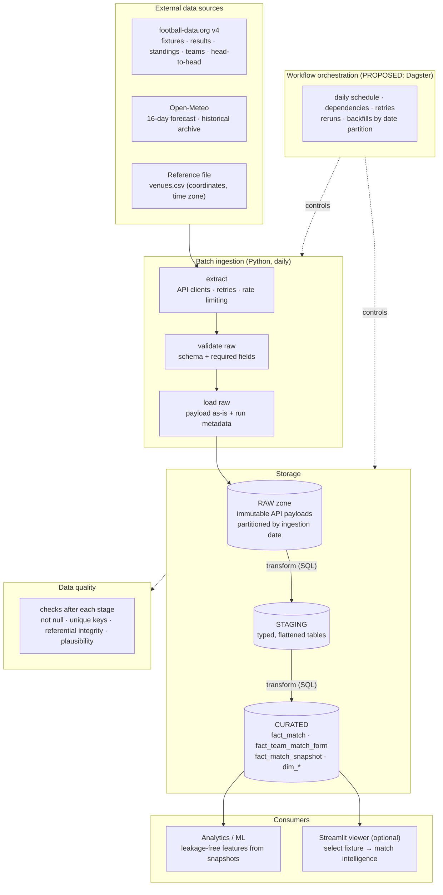
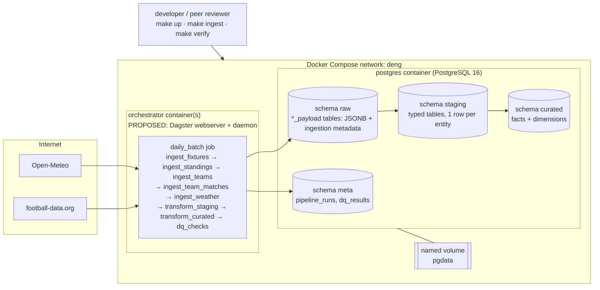
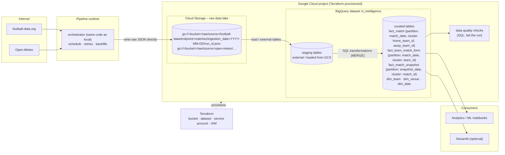
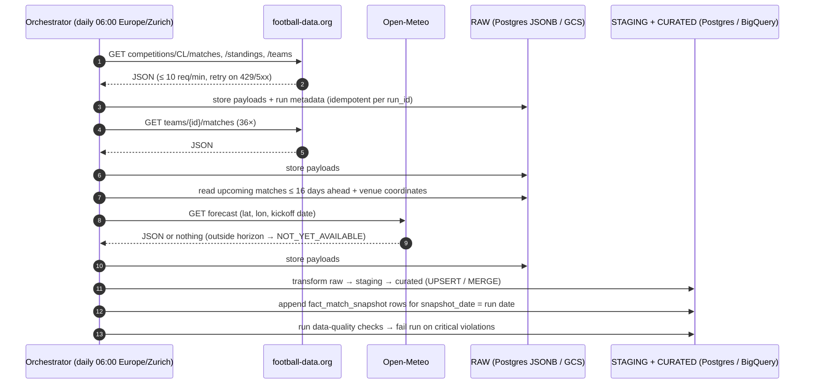

# Architecture v0.1 (Milestone 1 – initial pitch)

Status: **initial proposal, 18 Sep 2026.** Everything marked *PROPOSED* is
decided in an ADR after a technical spike; see [`docs/adr/`](../adr/README.md).
Changes and lessons learned will be recorded in `architecture-v0.2.md` (midterm)
and `architecture-final.md` (final).

## 1. Conceptual view

The GUI never talks to external APIs. Everything flows through one batch
pipeline that writes raw data first and derives curated data from it.

## 2. Local / midterm view (Docker Compose)

Goal of the midterm: the complete pipeline runs locally with one command,
PostgreSQL holds raw, staging and curated schemas, the orchestrator schedules
the daily batch and supports reruns and backfills.

Key properties:

* **Raw first.** Every API response is stored unchanged (JSONB) together with
  `source`, `endpoint`, `request_params`, `ingested_at`, `run_id`. Staging and
  curated tables can always be rebuilt from raw – that is what makes backfills
  and schema fixes cheap.
* **Idempotent loads.** Staging/curated tables have business keys
  (`match_id`, `team_id`, `(match_id, team_id)`, `(match_id, snapshot_date)`)
  with unique constraints; loads are `INSERT … ON CONFLICT DO UPDATE`.
  Running the same day twice yields identical row counts.
* **Backfill = rerun for a date partition.** Each run is parameterised by a
  logical date; a backfill for `2026-10-01 … 2026-10-10` replays the
  transformation from the raw payloads of those days (raw is re-fetched only
  for data the API still serves).
* **One network, health checks, env-file configuration.** The orchestrator waits
  for PostgreSQL's health check; no credentials in images.

## 3. Final / cloud view (Google Cloud)

The production ingestion writes straight from the API to Google Cloud Storage –
no local file is a required intermediate step. Local storage remains for
development, tests and caching.

*Where the orchestrator runs in the cloud (Cloud Run job vs. a VM vs. local
Docker with cloud credentials) is deliberately open – see the backlog. The
rubric requires infrastructure for storage and warehouse via Terraform; compute
placement is a secondary decision to be made after the midterm.*

## 4. Data flow per daily run (both environments)

## 5. Milestone-1 decisions and open points

| Topic | Decision | Status |
|---|---|---|
| Football source | football-data.org free tier | PROPOSED → [ADR-001](../adr/ADR-001-football-data-source.md) |
| Weather source | Open-Meteo | PROPOSED → [ADR-001](../adr/ADR-001-football-data-source.md) |
| Raw storage | keep unchanged payloads; JSONB locally, JSON objects on GCS | PROPOSED → [ADR-003](../adr/ADR-003-raw-data-storage.md) |
| Orchestrator | Dagster favoured (partitions = backfills), spike before midterm sprint | PROPOSED → [ADR-002](../adr/ADR-002-workflow-orchestrator.md) |
| Transformation tool | SQL files executed by the orchestrator (no dbt for now) | open – evaluated with ADR-002 spike |
| Batch frequency | once per day (data changes at most a few times per day; forecast models update 1–6 h) | PROPOSED |
| Snapshot table | included from the midterm on – one extra append step per run | PROPOSED |
| Cloud compute | open (Cloud Run job vs. local runner with cloud credentials) | open |

## 6. Division of responsibilities (proposal)

Both students must be able to explain the whole architecture. Ownership below
means "drives the implementation and writes the docs", not "only person who
understands it". Every pull request is reviewed by the other student.

| Area | Owner | Reviewer |
|---|---|---|
| Football ingestion, API client, raw model | Elias Martinelli | Noah Rodriguez |
| Weather ingestion, venue reference data | Noah Rodriguez | Elias Martinelli |
| PostgreSQL schemas, SQL transformations, data quality | Noah Rodriguez | Elias Martinelli |
| Orchestration, Docker Compose, Makefile, CI | Elias Martinelli | Noah Rodriguez |
| Terraform, GCS, BigQuery model, partitioning | shared – pair session, then split by table | – |
| Documentation, architecture evolution, evidence | shared – each documents what they built | – |
| Peer reviews of other teams | both, independently, then merged | – |
