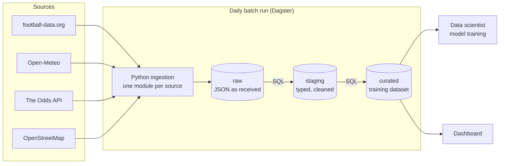

# Project Pitch - Champions League Match Intelligence

HSLU · DENG Data Engineering · HS26 · Elias Martinelli, Noah Rodriguez

A short overview for the initial pitch (Milestone 1). The details live in the
linked documents.

---

## 1. Idea, story and motivation

Before every Champions League match, the same question comes up: **who is
going to win?** Bookmakers, pundits and fans all have an opinion. We want to
make it possible to answer that question with a model, and to answer it
*fairly*.

The problem is not the model, it is the data. The information about a match is
spread over several sources that change at different speeds: the fixture list
exists months ahead, the table changes after every matchday, a weather forecast
only exists two weeks out, and betting odds move by the minute. Every API only
ever answers with **today's** state. What was known last week is gone unless
someone stored it.

A model trained on data that already "knows" the result looks great in testing
and fails in reality (data leakage). So our project is the part nobody sees:
**a daily batch pipeline that records what was known about a match, and when.**

## 2. Data sources

Four free, documented APIs, no scraping:

| Source | What we take from it |
|---|---|
| **football-data.org** (v4) | fixtures, results, teams, standings - the backbone and the label |
| **Open-Meteo** | weather forecast for the kick-off hour |
| **The Odds API** (v4) | home / draw / away odds of European bookmakers - the market's view |
| **OpenStreetMap** (Nominatim) | stadium coordinates, so we know *where* to ask for the weather |

More on each source and the alternatives we rejected:
[`docs/data-sources.md`](../data-sources.md).

## 3. Use case and outcome

**User:** a data scientist who wants to train and evaluate a match-outcome
model (home win / draw / away win).

**Outcome:** a **clean, documented dataset to train a model that predicts the
result** - one row per match, with the label and every feature that was known
*before* kick-off (form, table position, weather forecast, odds).

Training the model itself is the downstream use, not part of this project. The
pipeline is the product. A small dashboard on top lets a human check the data
before trusting it.

More: [`docs/use-case.md`](../use-case.md).

## 4. Data characteristics, risks and challenges

**Characteristics**

* **Small volume, deep history:** one season has under 200 matches and a daily
  run is a few requests and under 2 MB. Past seasons can be loaded once to get
  enough training data.
* **Nested JSON** with stable integer IDs for matches, teams and seasons.
* **Changes over time:** kick-off times move, scores arrive after the match,
  and new fixtures appear mid-season (knockout draw in December).

**Risks and anticipated challenges**

* **Data leakage** - the main challenge: every feature must be limited to what
  was known before kick-off.
* **Rate limits** on the free tiers (10 requests/minute for football data, 500
  odds credits per month) - we have to plan requests carefully.
* **Forecasts are overwritten** - Open-Meteo only looks 16 days ahead and has no
  history of past forecasts, so we must store them ourselves every day.
* **Joining sources** - bookmakers spell club names their own way
  ("Bayern Munich" vs. "FC Bayern München"), and the football API has no
  stadium coordinates.
* **API quirks** - fields that are always empty, statuses that do not match the
  filter, aggregates that do not add up. We measure them rather than trust them.

## 5. Initial ingestion and storage strategy

**Ingestion: one daily batch run, "ingest everything first, transform
afterwards".**

* Each source has its own small Python module.
* Football data is reloaded in **full** every day - it is only a few requests
  and catches added or rescheduled matches automatically.
* Past seasons are loaded **once**; they never change.
* Weather is fetched daily, only for matches inside the forecast window.
* Odds are fetched on a credit budget; stadium coordinates once per club.
* Retries with back-off for temporary errors; every run is logged.

**Storage: three layers.**

| Layer | Content |
|---|---|
| `raw` | every API answer exactly as received (JSON), with when we asked |
| `staging` | the same data typed and cleaned |
| `curated` | the data product: facts, dimensions and the training table |

Because every raw answer is kept, the whole dataset can be rebuilt from our own
storage without asking an API again.

Locally this is **PostgreSQL in Docker Compose**; for the final milestone the
same layers move to **Google Cloud Storage** (raw files) and **BigQuery**
(warehouse), provisioned with Terraform.

## 6. Architecture v0.1

* **Orchestration:** Dagster schedules the daily run and supports reruns and
  backfills.
* **Local:** PostgreSQL + Dagster in Docker Compose.
* **Cloud (final):** GCS for raw data, BigQuery for the warehouse, Terraform for
  the infrastructure.

Full design with all views: [`docs/architecture/architecture-v0.1.md`](../architecture/architecture-v0.1.md).

### Planned division of responsibilities

Both of us must be able to explain the whole pipeline. "Owner" means drives the
work; every pull request is reviewed by the other person.

| Area | Owner |
|---|---|
| Football ingestion, API client, raw layer | Elias Martinelli |
| Weather ingestion, venue data | Noah Rodriguez |
| PostgreSQL schemas, SQL transformations, data quality | Noah Rodriguez |
| Orchestration, Docker Compose, CI | Elias Martinelli |
| Terraform, GCS, BigQuery | shared |
| Documentation | shared - each documents what they built |
