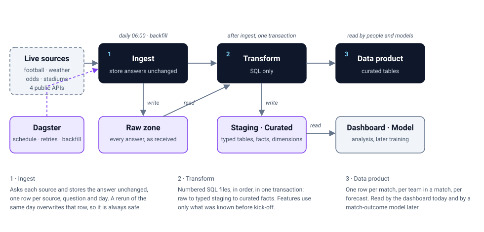
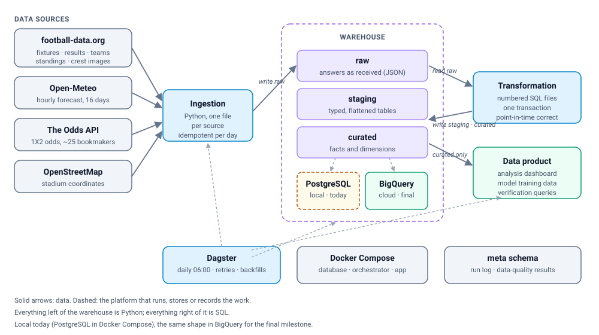
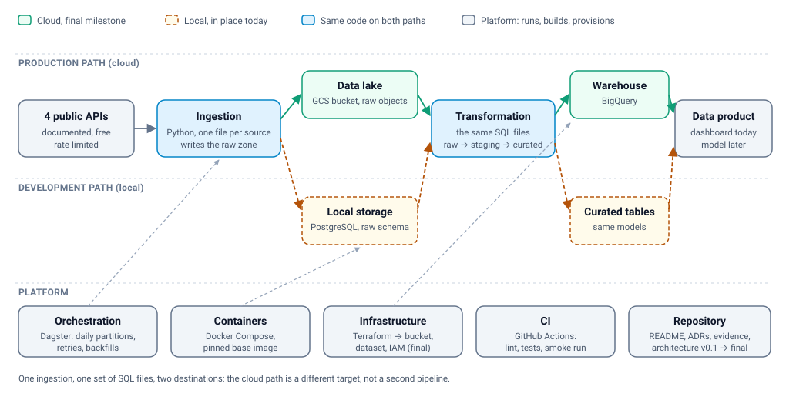

# Initial pitch - Champions League Match Intelligence

One `##` heading per slide. Speaker notes in German:
[`speaker-notes.md`](speaker-notes.md).

---

## 1 - Champions League Match Intelligence

**A data pipeline that records, every day, what was known about a match -
so a model can later predict who wins.**

HSLU · DENG Data Engineering · HS26
Elias Martinelli · Noah Rodriguez
Repository: `github.com/Elias-Martinelli/deng`

---

## 2 - The use case: it exists because of the model

> Who wins the match on matchday X - and can we answer that fairly?

The use case is a **match-outcome model**. Everything in this project exists
because that model needs data. A fair model may only use what was known
**before kick-off** - and that is the hard part, because the sources only ever
answer with **today's** state:

* the fixture list exists months ahead, kick-off times still move;
* form and the table change after every matchday;
* a weather forecast exists at most 16 days ahead and is then overwritten;
* bookmaker odds move by the minute.

What was known last week is gone unless somebody stores it. **That storing is
the project.** The model is what the data is for, not part of this project.

---

## 3 - End user and data product

**Primary user: a data scientist** who wants to train and test a match-outcome
model and needs data they can trust.

| What they get | One row is | Why it matters |
|---|---|---|
| `curated.model_features` | one match | **what a model reads**: the label plus every feature known before kick-off |
| `fact_match` | one match | the label: home win / draw / away win |
| `fact_team_match_form` | one team in one match | form from matches finished **before** that kick-off |
| `fact_match_weather` | one match | the forecast for the kick-off hour, fetched **before** kick-off |
| `fact_bookmaker_odds` | one odds change of one bookmaker for one match | what the market thought, as a benchmark |

`model_features` exists today as a view over the curated tables. The final
milestone adds one row per match **per day**, so "what was known 5 days before
kick-off" becomes a query.

Secondary user: an analysis dashboard on the same tables, so a human can see
exactly what the model would see.

---

## 4 - Dataset and source systems

Four providers, five ingestion steps - one small Python module each.

| Source | What we take | Access | Cost control |
|---|---|---|---|
| **football-data.org** v4 | fixtures, results, teams, standings | free tier, API key | 10 requests/minute; **4 requests a day** |
| **football-data.org** (images) | club crests | same key | fetched once per crest URL, then never again |
| **Open-Meteo** | hourly forecast for the kick-off hour | free, no key | one request per stadium, only for matches ≤ 16 days away |
| **The Odds API** v4 | 1X2 odds of ~25 EU bookmakers | free plan, API key | 500 credits a month; the pipeline decides per run whether to spend one |
| **OpenStreetMap** (Nominatim) | stadium coordinates | free, fair-use | once per club, 1 request/second |

All of them are documented, free and reachable without scraping. Details and
the rejected alternatives: [`docs/data-sources.md`](../data-sources.md).

---

## 5 - What the data looks like (measured, not assumed)

**Volume is small, history is deep.**

| Season | Matches | Note |
|---|---|---|
| 2023/24 | 125 | old format: group stage |
| 2024/25 | 189 | first league phase, incl. knockout rounds |
| 2025/26 (current) | 144 | league phase, knockout rounds drawn in December |

* The API lists **47 seasons**. One season is **one request of ~212 KB**.
* With 2023 and 2024 ingested next to the current season the curated layer holds
  **458 matches, 60 clubs, 332 of them with a result as the label**, and 664 rows
  of team form.
* **Formats differ:** football data is nested JSON per competition, weather is
  columnar arrays per coordinate, odds are one document per bookmaker snapshot.
* **The format changed in 2024/25:** group stage → single league phase. Older
  seasons stay usable, but a model has to know which is which.
* **Availability differs per attribute:** fixtures months ahead, standings after
  matchday 1, weather ≤ 16 days, odds days before, the result minutes after.

---

## 6 - Risks and challenges we already measured

| Finding | Consequence for the design |
|---|---|
| `?status=SCHEDULED` returns rows stored as `TIMED` | upcoming matches are selected by kick-off time, never by the status text |
| the API's own aggregates do not add up, `standings.form` is null | every form figure is computed by us from single matches |
| `group` is null since the 2024/25 format change | no group dimension is modelled |
| searching stadiums blindly put Napoli in Novara and Roma in Turin | every coordinate was reviewed once by a human; the verdict is stored next to the untouched answer |
| the free tiers are metered (10/min, 500 credits/month) | pacing, retry rules and a credit budget are part of the pipeline |
| forecasts and odds are overwritten at the source | every answer is stored with the day it was fetched - our archive is the only history |

The biggest risk is not technical: **data leakage**. A model that sees the match
it predicts looks brilliant and is worthless.

---

## 7 - Ingestion and storage strategy

**Ingest everything first, transform afterwards.**

1. **Ingest** - ask every source, store the answer **unchanged** as JSON in the
   `raw` schema, with who answered, to which question, on which day.
   *One row per (source, endpoint, parameters, day)* - running the same day
   twice overwrites that row instead of adding a copy, so a rerun is safe.
2. **Transform** - only SQL, from `raw` to typed `staging` tables to `curated`
   facts and dimensions. Each step either lands completely or not at all, so a
   table is never half-built.
3. **Serve** - the curated tables are the data product.

| Source | Strategy | Why |
|---|---|---|
| fixtures, results, teams, standings | full reload per day, 4 requests | small payload, self-healing |
| **past seasons** | **once, 2 requests per season** | **the training data - a finished season never changes** |
| club crests | once per crest URL | a new crest arrives under a new URL |
| weather | per stadium, only inside the 16-day horizon | a forecast beyond it does not exist |
| odds | on a budget, more often close to kick-off | 500 credits a month |
| stadium coordinates | once per club | stadiums do not move |

Storage: **PostgreSQL** locally (four schemas: `raw`, `staging`, `curated`,
`meta`), Google Cloud Storage + BigQuery in the final milestone.

---

## 8 - Architecture v0.1 - the three stages

**This is the whole project in one picture.** Three stages, and each stage is a
folder in the repository:

* **Ingest** - `src/deng/sources/`, one small Python module per source, all with
  the same shape;
* **Transform** - `sql/transform/`, numbered SQL files, run in order; a step
  either lands completely or not at all;
* **Data product** - the curated tables, read by the dashboard today and by a
  model later.

One rule holds the picture together and is enforced by a test: **ingestion may
read the APIs and the raw zone - never the transformed tables.**

---

## 9 - What runs today, in detail

| In the picture | In the repository |
|---|---|
| one file per source | `src/deng/sources/` - 5 modules, each answering *what to fetch* and *how* |
| the ingestion | `src/deng/ingestion/runner.py` - runs the five sources in order, records every run |
| raw · staging · curated | `sql/schema/` - 11 files |
| the transformation | `sql/transform/` - 13 numbered files |
| run log | the `meta` schema - "did yesterday work?" is a query, not a log search |

Local Docker Compose: PostgreSQL, the orchestrator (Dagster, daily at 06:00,
with retries and backfills) and the dashboard. Real sample answers are committed,
so `make up && make run-samples` runs the whole pipeline **without an API key**.

---

## 10 - Where it goes, and who does what

**This is the target.** In the final milestone the same code writes the raw zone
to Google Cloud Storage and the curated tables to BigQuery, with Terraform
provisioning both. The local path stays for development - same sources, same SQL.

| Area | Owner | Reviewer |
|---|---|---|
| Football ingestion, raw model, past seasons | Elias | Noah |
| Weather, stadium coordinates | Noah | Elias |
| Transformations, data model | Noah | Elias |
| Orchestration, Docker, CI | Elias | Noah |
| Odds, forecast baseline | Elias | Noah |
| Dashboard, notebook | Noah | Elias |
| Cloud (Terraform, GCS, BigQuery) | shared | - |

Milestones: midterm 22 Oct (local pipeline), final 10 Dec (cloud pipeline).
Plan: [`docs/project-backlog.md`](../project-backlog.md).
